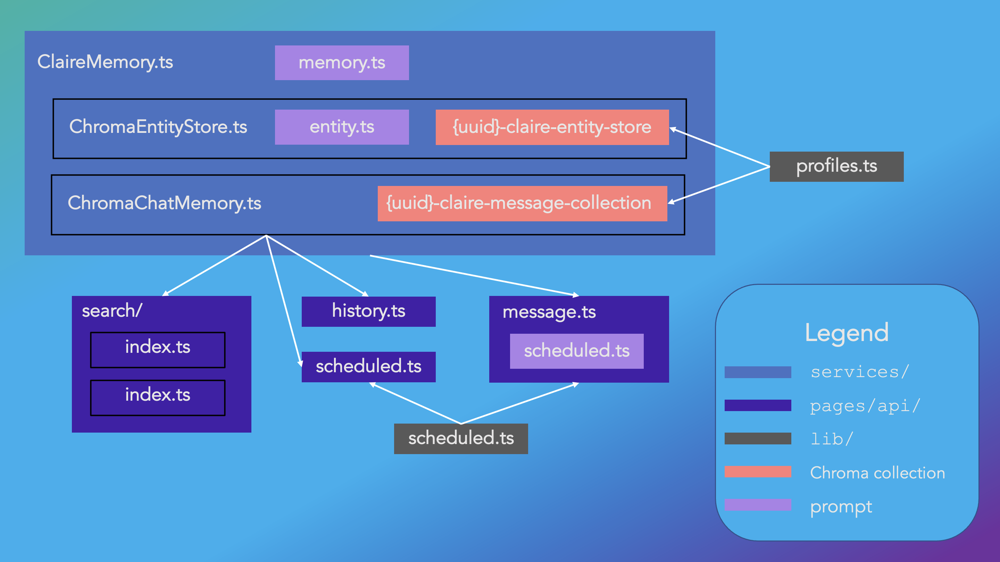

# CLAIRe

## Abilities
### Active messaging
CLAIRe can proactively reach out to you to follow up on past conversations, challenging the conventional call-response paradigm of AI interactions:


### Entity recall
CLAIRe remembers information it has learned about entities in its conversations and can synthesize information from the current conversational context, known information about entities, and semantically relevant past messages to form cohesive, natural responses.


### Message search/history
CLAIRe autoloads message history as you scroll through your messages. It also supports both exact and semantic (through Chroma) message search. The syntax for semantic message search is as follows:

Format: `/semantic {number of results – default 10} search term`

Example: `/semantic adventure story`

Example: `/semantic {2} bad dates`


### Profiles
CLAIRe supports separate profiles backed by separate Chroma collections to prevent cross-over of information.

## Architecture
Learn more about how CLAIRe works [here](https://brilliantly.ai/blog/claire/).

The below diagram illustrates the relationship between some of the main components of CLAIRe's backend.



## Getting Started

### Using CLAIRe as is
To run CLAIRe, you'll need to have [Docker](https://www.docker.com/get-started/).

```bash
git clone https://github.com/suvansh/CLAIRe.git  # clone this repo
git clone https://github.com/chroma-core/chroma.git  # clone Chroma, used for the DB
cd CLAIRe
cp .env.example .env.local
```
Now edit `.env.local` and fill in your OpenAI API key, used for chat responses as well as the embeddings backing Chroma's semantic search.

Staying in the `CLAIRe` directory, you can launch CLAIRe and Chroma in a shared network:
```
docker-compose up -d --build
```

Note that CLAIRe's [Docker Compose file](docker-compose.yml) relies on Chroma being in the same directory as CLAIRe, but you can edit the path to suit your setup.

Open [http://localhost:3000](http://localhost:3000) in your browser to use CLAIRe!

### Development
First, run Chroma 

Next, the development server in the project root directory:

```bash
npm run dev
```

Open [http://localhost:3000](http://localhost:3000) in your browser to use CLAIRe!
